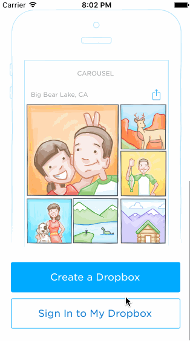

## Carousel

The purpose of this homework is to leverage views, view properties, and events to create a high fidelity prototype that is difficult to distinguish from a production app. We're going to use the techniques from this week to implement the Carousel app from the signed out state to the basic signed in state.

Time spent: `8 hours`

### Features

#### Required

- [x] Static photo tiles on the initial screen.
- [x] Sign In.
  - [x] Tapping on email/password reveals the keyboard and shifts the scrollview and Sign In button up.
  - [x] User sees an error alert when no email is present or no password is present.
  - [x] User sees a activity indicator upon tapping the Sign In button.
  - [x] User sees an error alert when entering the wrong email/password combination.
  - [x] User is taken to the tutorial screens upon entering the correct email/password combination.
- [x] Tutorial Screens.
  - [x] User can page between the screens.
- [x] Image Timeline.
  - [x] Display a scrollable view of images.
  - [x] User can tap on the conversations button to see the conversations screen (push).
  - [x] User can tap on the profile image to see the settings view (modal from below).
- [x] Settings.
  - [x] User can dismiss the settings screen.
  - [x] User can log out.

#### Optional

- [ ] Photo tiles move with scrolling.
- [ ] Sign In
  - [x] When the keyboard is visible, if the user pulls down on the scrollview, it will dismiss the keyboard
  - [x] On appear, scale the form up and fade it in.
- [ ] Sign Up
  - [x] Tapping in the form reveals the keyboard and shifts the scrollview and "Create a Dropbox" button up.
  - [ ] Tapping the Agree to Terms checkbox selects the checkbox.
  - [ ] Tapping on Terms shows a webview with the terms.
  - [x] User is taken to the tutorial screens upon tapping the "Create a Dropbox" button.
- [ ] Tutorial Screens.
  - [x] User can page between the screens with updated dots.
  - [x] Upon reaching the 4th page, hide the dots and show the "Take Carousel for a Spin" button.
- [ ] Learn more about Carousel.
  - [ ] Show the "Learn more about Carousel" button in the photo timeline.
  - [ ] Tap the X to dismiss the banner.
  - [ ] Track the 3 events:
    - [ ] View a photo full screen.
    - [ ] Swipe left and right.
    - [ ] Share a photo.
  - [ ] Upon completion of the events, mark them green.
  - [ ] When all events are completed, dismiss the banner.

#### The following **additional** features are implemented:

- [ ] List anything else that you can get done to improve the app functionality!

Please list two areas of the assignment you'd like to **discuss further with your peers** during the next class (examples include better ways to implement something, how to extend your app in certain ways, etc):

1. I'd like to try implementing the animated intro images.
2. 

### Video Walkthrough 

Here's a walkthrough of implemented user stories:

GIF created with [LiceCap](http://www.cockos.com/licecap/).

## Notes

I ran into some issues getting things to work on top of the scroll views, like the button image on the tutorial screens. 

* Any libraries or borrowed content.
